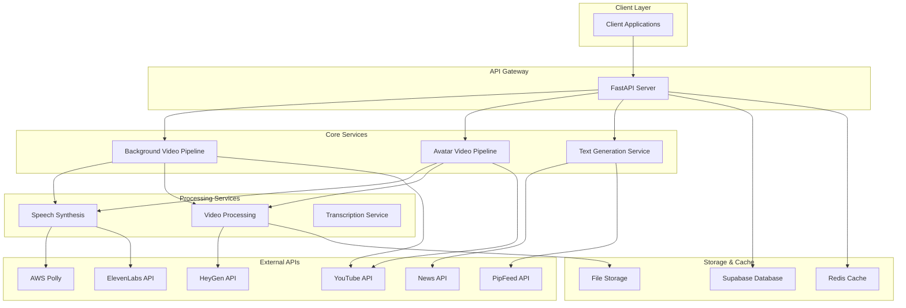
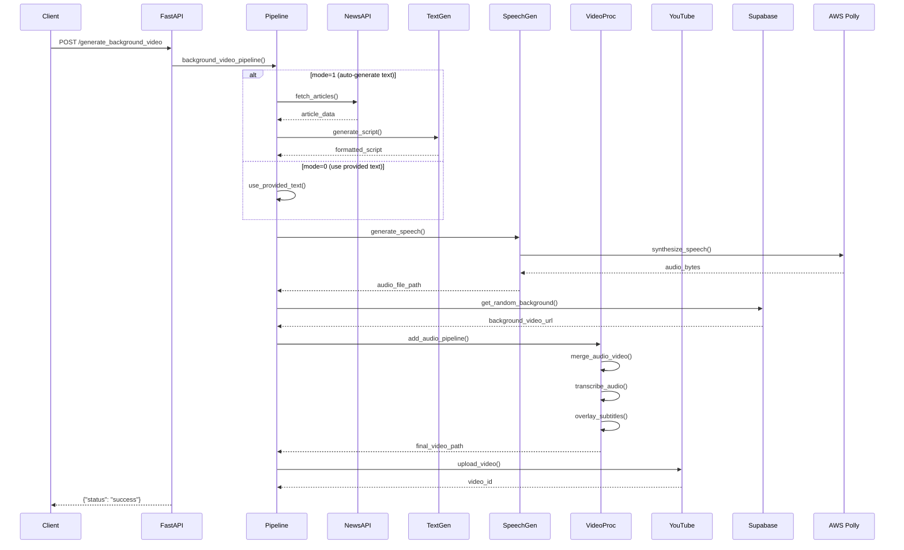
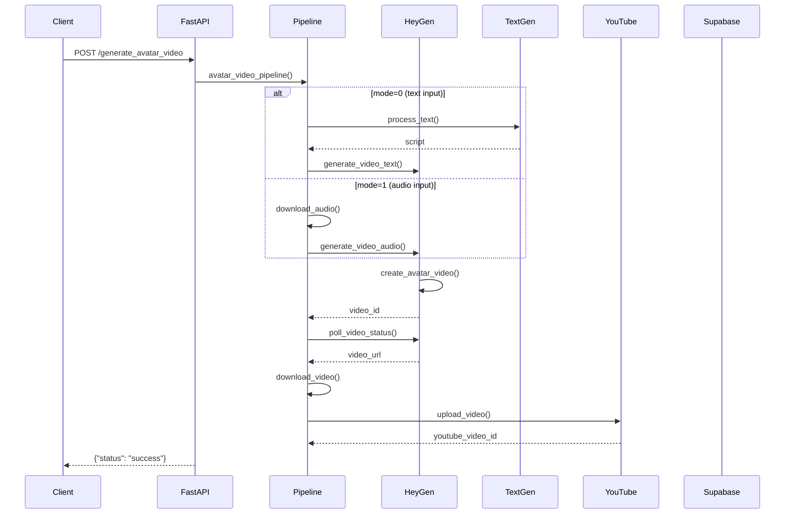
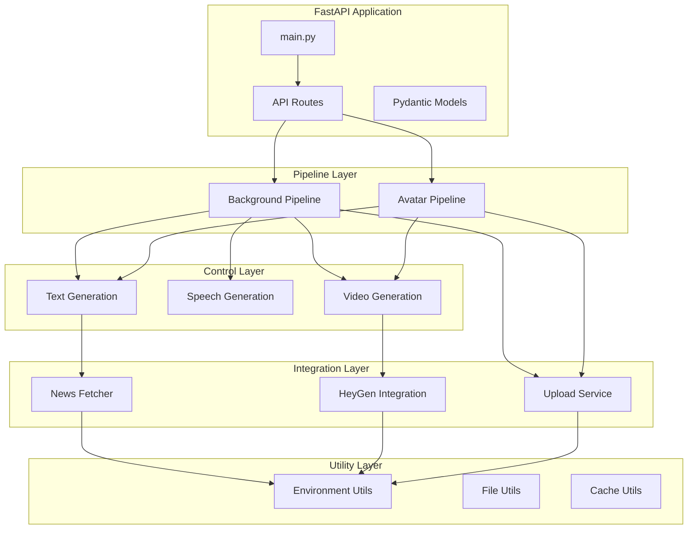
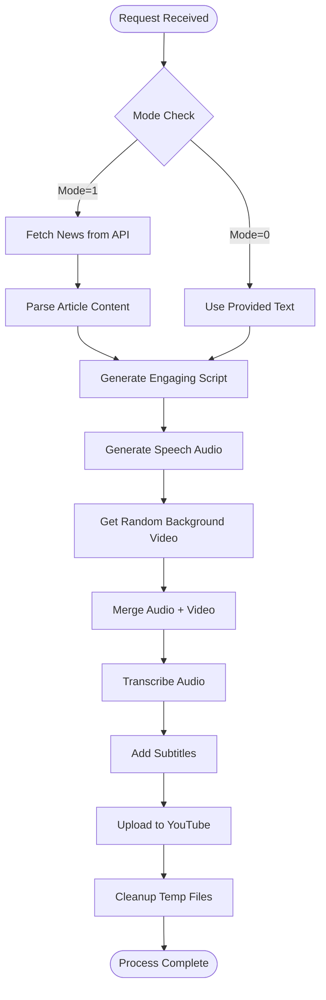
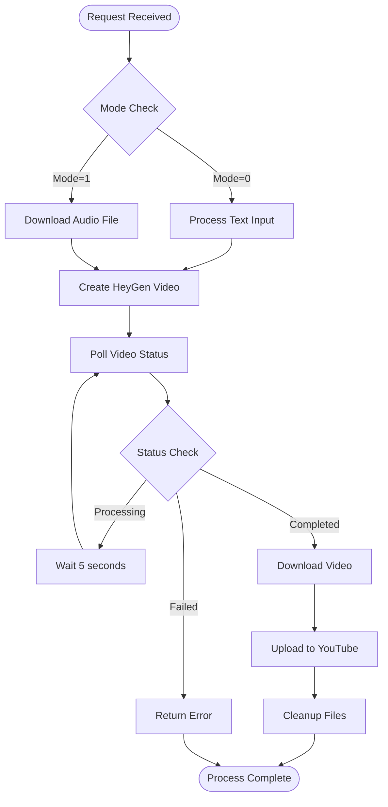

## System Overview

The Video Generation API is a FastAPI-based service that automatically creates short-form videos with AI avatars or background content. It integrates multiple external services to fetch news, generate speech, create videos, and upload to YouTube.

### Key Features
- **Background Video Generation**: Creates videos with text overlays and narration
- **Avatar Video Generation**: Uses AI avatars with lip-sync capabilities
- **Automated Content Pipeline**: Fetches trending news and generates engaging scripts
- **Multi-platform Integration**: YouTube upload, Redis caching, Supabase storage

---

## High-Level Design



---

## Low-Level Design

### 1. Background Video Pipeline Architecture



### 2. Avatar Video Pipeline Architecture



### 3. Component Architecture



---

## Data Flow Diagrams

### 1. Background Video Generation Flow



### 2. Avatar Video Generation Flow



---

## Component Specifications

### 1. FastAPI Server (main.py)
- **Purpose**: HTTP API endpoint management
- **Key Features**:
  - CORS middleware for cross-origin requests
  - Background task processing
  - Request validation with Pydantic
  - Error handling and HTTP responses

### 2. Background Video Pipeline
- **Location**: `pipelines/pipeline.py`
- **Dependencies**: Speech generation, video processing, upload service
- **Key Functions**:
  - `background_video_pipeline()`: Main orchestration
  - `get_random_video_url()`: Background video selection

### 3. Avatar Video Pipeline
- **Location**: `pipelines/avatar_pipeline.py`
- **Dependencies**: HeyGen API, upload service
- **Key Functions**:
  - `avatar_video_pipeline()`: Main orchestration
  - File download and cleanup utilities

### 4. Text Generation Service
- **Location**: `control/generate_random_text.py`, `fetchData/summarise_feed.py`
- **AI Model**: Google Gemini 1.5 Flash
- **Features**:
  - News article summarization
  - Engaging script generation for short-form content
  - Viral content optimization

### 5. Speech Synthesis
- **Location**: `speech/polly.py`
- **Provider**: AWS Polly
- **Features**:
  - Multiple voice options
  - High-quality MP3 output
  - Async processing support

### 6. Video Processing
- **Location**: `heygen/add_audio.py`
- **Tools**: FFmpeg, Whisper, MoviePy
- **Features**:
  - Audio-video merging
  - Automatic transcription
  - Subtitle overlay with styling
  - Temporary file management

### 7. HeyGen Integration
- **Location**: `heygen/generate_video_text.py`, `heygen/generate_video_audio.py`
- **Features**:
  - AI avatar video generation
  - Text-to-speech with lip sync
  - Audio file lip sync
  - Video status polling

---

## Database Design

### Supabase Tables

#### 1. storeart
```sql
CREATE TABLE storeart (
    num SERIAL PRIMARY KEY,
    url TEXT UNIQUE NOT NULL,
    category TEXT,
);
```

#### 2. user_api_keys
```sql
CREATE TABLE user_api_keys (
    id UUID PRIMARY KEY,
    YOUTUBE_CLIENT_ID TEXT,
    YOUTUBE_CLIENT_SECRET TEXT,
    YOUTUBE_REFRESH_TOKEN TEXT,
    created_at TIMESTAMP DEFAULT NOW(),
    credits INT
);
```

### Redis Cache Structure
```
Key: "num"
Type: Integer
Purpose: Track current news article index

```

---


## External Service Integration

### 1. News APIs
- **News API**: Trending news fetching
- **PipFeed API**: Article content extraction

### 2. AI Services
- **Google Gemini**: Text generation and summarization
- **HeyGen**: Avatar video generation
- **AWS Polly**: Text-to-speech synthesis

### 3. Storage & Upload
- **Supabase**: Database and file storage
- **YouTube API**: Video upload and publishing
- **Redis**: Caching and session management

---

## Security Considerations

1. **API Key Management**: Environment variables for all external services
2. **File Cleanup**: Automatic temporary file removal
3. **Request Validation**: Pydantic models for input validation
4. **Error Handling**: Comprehensive exception management
5. **CORS Configuration**: Controlled cross-origin access

---

## Performance Optimizations

1. **Async Processing**: Non-blocking I/O operations
2. **Background Tasks**: Offload heavy processing
3. **Caching**: Redis for frequently accessed data
4. **File Streaming**: Efficient large file handling
5. **Connection Pooling**: Reuse HTTP connections

---

## Monitoring & Logging

- Request/response logging
- Error tracking and reporting
- Performance metrics collection
- External API call monitoring
- File processing status tracking

# API Documentation

## Base Information
- **Title**: FastAPI
- **Version**: 0.1.0
- **OpenAPI Version**: 3.1.0

## Endpoints

### 1. Generate Background Video
**POST** `/generate_background_video`

Generate a background video with text overlay and voice narration.

**Request Body**: `GenerateBackgroundRequest`
```json
{
  "user_id": "string (required)",
  "mode": 1,
  "text": "string (optional)",
  "voice_id": "74f0f8d1b27147c4aa9c65f690a3ead3",
  "font_path": "fonts/font.ttf",
  "title": "You won't believe what just happened!",
  "description": "Stay updated with the latest news in just 30 seconds!"
}
```

**Parameters**:
- `user_id` (string, required): Unique identifier for the user
- `mode` (integer, optional): Video generation mode (default: 1)
- `text` (string, optional): Text content for the video
- `voice_id` (string, optional): Voice ID for narration (default: "74f0f8d1b27147c4aa9c65f690a3ead3")
- `font_path` (string, optional): Path to font file (default: "fonts/font.ttf")
- `title` (string, optional): Video title (default: "You won't believe what just happened!")
- `description` (string, optional): Video description (default: "Stay updated with the latest news in just 30 seconds!")

### 2. Generate Avatar Video
**POST** `/generate_avatar_video`

Generate a video with an avatar speaking the provided text or audio.

**Request Body**: `GenerateAvatarRequest`
```json
{
  "user_id": "string (required)",
  "mode": 1,
  "avatar_id": "de90ffeec028414a90ad2d954dc85b41",
  "audio_url": "string (optional)",
  "text": "string (optional)",
  "voice_id": "74f0f8d1b27147c4aa9c65f690a3ead3",
  "title": "You won't believe what just happened!",
  "description": "Stay updated with the latest news in just 30 seconds!"
}
```

**Parameters**:
- `user_id` (string, required): Unique identifier for the user
- `mode` (integer, optional): Video generation mode (default: 1)
- `avatar_id` (string, optional): Avatar identifier (default: "de90ffeec028414a90ad2d954dc85b41")
- `audio_url` (string, optional): URL to audio file for lip-sync
- `text` (string, optional): Text for the avatar to speak
- `voice_id` (string, optional): Voice ID for text-to-speech (default: "74f0f8d1b27147c4aa9c65f690a3ead3")
- `title` (string, optional): Video title (default: "You won't believe what just happened!")
- `description` (string, optional): Video description (default: "Stay updated with the latest news in just 30 seconds!")

### 3. Generate Random Text
**POST** `/generate_random_text`

Generate random text content.

**Request Body**: `GenerateRandom`
```json
{
  "text": "string (optional)"
}
```

**Parameters**:
- `text` (string, optional): Input text for random generation

### 4. Root Endpoint
**GET** `/`

Health check endpoint that returns basic API information.

## Response Formats

### Success Response (200)
All endpoints return a JSON response with the generated content or confirmation.

### Validation Error Response (422)
```json
{
  "detail": [
    {
      "loc": ["string or integer"],
      "msg": "string",
      "type": "string"
    }
  ]
}
```

## Usage Examples

### Generate Background Video
```bash
curl -X POST "http://your-api-url/generate_background_video" \
  -H "Content-Type: application/json" \
  -d '{
    "user_id": "user123",
    "text": "Welcome to our latest update!",
    "title": "Product Launch",
    "description": "Exciting news about our new features"
  }'
```

### Generate Avatar Video
```bash
curl -X POST "http://your-api-url/generate_avatar_video" \
  -H "Content-Type: application/json" \
  -d '{
    "user_id": "user123",
    "text": "Hello everyone, welcome to today'\''s presentation!",
    "avatar_id": "de90ffeec028414a90ad2d954dc85b41"
  }'
```

### Generate Random Text
```bash
curl -X POST "http://your-api-url/generate_random_text" \
  -H "Content-Type: application/json" \
  -d '{
    "text": "Generate content about technology trends"
  }'
```

## Notes

- All POST endpoints require a JSON request body
- The `user_id` parameter is required for video generation endpoints
- Default values are provided for most optional parameters
- Voice and avatar IDs should be valid identifiers from your system
- Font paths should point to accessible font files in your system


asyncio.to_thread when calling sync
asyncio.create_task when calling async

## Environment Variables

```env
ELEVENLABS_API_KEY=
HEYGEN_API_KEY=
NEWS_API_KEY=
PIPFEED_API_KEY=
SUPABASE_URL=
SUPABASE_KEY=
GOOGLE_API_KEY=
YOUTUBE_CLIENT_ID=
YOUTUBE_CLIENT_SECRET=
YOUTUBE_REFRESH_TOKEN=
AMAZON_ACCESS_KEY=
AMAZON_SECRET_KEY=
REDIS_PASSWORD=
REDIS_HOST=
REDIS_PORT=
PORT=8081
```
